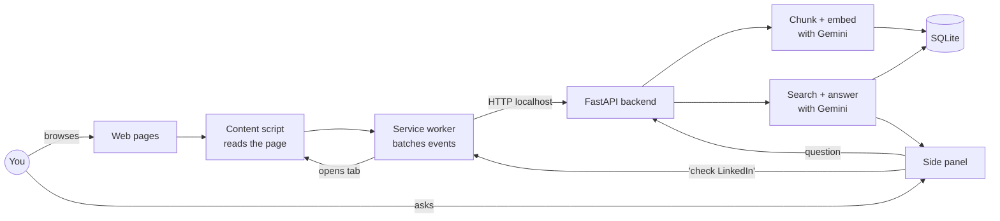

# pc_agent

Your browser history remembers the URLs you visited. pc_agent remembers what was on the page.

[](https://github.com/adityaramkumar/pc_agent/actions/workflows/backend.yml)
[](https://github.com/adityaramkumar/pc_agent/actions/workflows/extension.yml)

## The problem

You read a great article about housing policy three weeks ago. You can't remember the name of it. You remember the author drank a lot of coffee and worked at a magazine, but Google is useless because you can't remember any of the words they used.

Every knowledge worker has this problem. Browser history is a time-ordered list, so it's only useful if you remember *when*. Search history is only useful if you remember *what you typed*. Neither helps when you only remember the vibe.

## What pc_agent does

Three things:

1. **It watches.** A Chrome extension quietly saves the pages you read, the text you highlight, and the messages you send through forms. Passwords and credit card fields are skipped. Banks and password managers are skipped.
2. **It remembers.** A tiny Python server running on your own machine turns all of that into a searchable memory. Nothing leaves your computer except the occasional request to Google's Gemini API (for embeddings and answering your questions).
3. **It answers.** Open the side panel. Ask a question in plain English. Get an answer with links back to the original pages.

Example questions that should work after a week of browsing:

- "What was that pricing page Sam sent me last Tuesday?"
- "Find the GitHub issue I read about websocket reconnects."
- "What was I writing to Ana yesterday before I got distracted?"
- "Summarize everything I read about rent control this month."

If the answer needs something fresh, pc_agent can also open a tab in the background and go look. Questions like *"check what Priya replied on LinkedIn"* work by opening LinkedIn in a hidden tab, reading the reply, and closing the tab. You see the answer in the side panel.

## How it's built



Two pieces, both running on your laptop:

- **A Chrome extension** (`extension/`), which captures what you read and shows the side panel UI.
- **A Python server** (`backend/`) running on `127.0.0.1:8765`, which stores your data in one SQLite file and talks to Gemini on your behalf.

Nothing is hosted. There is no cloud service. If you delete the SQLite file, the memory is gone.

## Quick start

You need Python 3.11+ and Node 20+. You also need a Gemini API key, which is free to get at [aistudio.google.com/apikey](https://aistudio.google.com/apikey).

### 1. Start the backend

```bash
git clone git@github.com:adityaramkumar/pc_agent.git
cd pc_agent/backend
python -m venv .venv
source .venv/bin/activate
pip install -e '.[dev]'
cp .env.example .env
# open .env and paste in your GOOGLE_API_KEY
uvicorn app.main:app --host 127.0.0.1 --port 8765 --reload
```

The server binds to `127.0.0.1` on purpose. There's no authentication, so it must not be exposed to the outside world.

### 2. Build and load the extension

```bash
cd ../extension
npm install
npm run build
```

Then in Chrome:

1. Go to `chrome://extensions`.
2. Turn on "Developer mode" (top right).
3. Click "Load unpacked" and pick the `extension/dist` folder.
4. Pin the pc_agent icon to your toolbar.
5. Click the icon to open the side panel.

Now browse the web for a day or two. Come back and ask a question.

## Settings

All settings live in `backend/.env`:

| Setting | Default | What it does |
|---|---|---|
| `GOOGLE_API_KEY` | (required) | Your key from [aistudio.google.com/apikey](https://aistudio.google.com/apikey). |
| `LLM_MODEL` | `gemini-2.5-flash` | The chat model. Set to `gemini-2.5-pro` for harder questions. |
| `EMBEDDING_MODEL` | `gemini-embedding-001` | The embedding model. |
| `DB_PATH` | `~/.pc_agent/memory.db` | Where your captured data is stored. |
| `BACKEND_HOST` | `127.0.0.1` | Must stay on localhost. |
| `BACKEND_PORT` | `8765` | Change if this port is taken. |

Runtime settings (pause capture, add domains to the blocklist) live in the extension's Activity tab and are stored locally by Chrome.

## Privacy

Things you should know:

- **Passwords and credit card fields are never captured.** The content script skips `<input type="password">`, any field with `autocomplete="cc-number"` / `one-time-code` / `current-password` and similar, and fields whose name looks like `ssn`, `otp`, `cvv`, or `pin`.
- **A default blocklist protects obvious stuff.** Banks, password managers, and Google account pages are excluded out of the box. You can add more in the Activity tab.
- **Incognito tabs are ignored.** The extension is not allowed in incognito by default.
- **Your data lives in one file.** It's at `~/.pc_agent/memory.db`. Delete it to wipe everything.
- **The only thing that leaves your machine** is your question plus the short text snippets it matched, sent to Gemini so it can write an answer. Your browsing history is never sent as a whole.

## Roadmap

Shipping in v0 (this repo):

- Capturing page visits, highlights, and form inputs from Chrome.
- Asking questions in English and getting cited answers.
- "Go check X" style tasks that open a background tab and read a page.

Not yet:

- Keystroke capture outside the browser (Slack desktop, iMessage, etc).
- Running on anything other than your own laptop.
- Clicking through multi-step flows (composing and sending an email, filling out a form).
- Proactive notifications ("someone replied to your post").
- More careful PII scrubbing inside the captured text itself.

## License

MIT. See [LICENSE](LICENSE).
