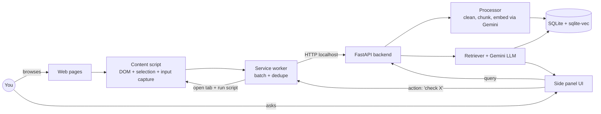

# pc_agent

Personal browser memory + lightweight action agent, powered by Gemini.

[](https://github.com/adityaramkumar/pc_agent/actions/workflows/backend.yml)
[](https://github.com/adityaramkumar/pc_agent/actions/workflows/extension.yml)

## What it does

A research prototype with three loosely-coupled capabilities:

- **Capture** — a Chrome extension passively records pages you visit, text you highlight, and form fields you submit (passwords excluded). Sensible default blocklist.
- **Memory** — a local Python backend chunks, embeds, and indexes everything in SQLite + [`sqlite-vec`](https://github.com/asg017/sqlite-vec). Hybrid retrieval (vector + FTS5 + recency) makes natural-language questions like *"what was that pricing page Sam sent me last Tuesday?"* actually work.
- **Action (lite)** — Gemini function-calling lets the agent open a tab in the background, extract structured content, and answer questions like *"check what Priya replied to my last LinkedIn message"* without pixel-clicking.

Everything lives on `localhost`. Single API key (`GOOGLE_API_KEY`). No cloud, no auth, no multi-user. Designed to work for *you* on *your* machine.

## Demo

_Side-panel screenshot/GIF goes here once the UI lands._

## Architecture



Two processes: the extension and a local Python server. See [the action loop section](#action-loop) for how the side panel orchestrates Gemini's function-calling without exposing the backend to the browser's service-worker lifecycle.

## Quick start

```bash
git clone git@github.com:adityaramkumar/pc_agent.git
cd pc_agent
./scripts/setup-git-identity.sh   # only if you'll commit; safe to skip otherwise

# --- backend ---
cd backend
python -m venv .venv && source .venv/bin/activate
pip install -e '.[dev]'
cp .env.example .env              # then add GOOGLE_API_KEY
uvicorn app.main:app --host 127.0.0.1 --port 8765 --reload

# --- extension (in another terminal) ---
cd extension
npm install
npm run build
# then load extension/dist in chrome://extensions (Developer mode -> Load unpacked)
```

The backend binds to `127.0.0.1` only — there is no auth, so it must never be exposed on a public interface.

## Configuration

Backend reads from `backend/.env`:

- `GOOGLE_API_KEY` (required) — get one at [aistudio.google.com/apikey](https://aistudio.google.com/apikey). The free tier covers personal dogfooding comfortably.
- `LLM_MODEL` (default `gemini-2.5-flash`) — set to `gemini-2.5-pro` for harder questions.
- `EMBEDDING_MODEL` (default `gemini-embedding-001`) — 768-dim output, matched to the `sqlite-vec` schema.
- `DB_PATH` (default `~/.pc_agent/memory.db`) — where captured memory lives.
- `BACKEND_HOST` / `BACKEND_PORT` (default `127.0.0.1` / `8765`).

Extension reads from `chrome.storage.local` (set via the side panel's Activity tab):

- Master pause toggle.
- Domain blocklist (defaults: banks, password managers, `accounts.google.com`, anything in incognito).
- Optional allowlist mode (off by default).

## Privacy

- **What's captured**: page URL + title + extracted main content, text you highlight, non-password form values on `submit`.
- **What's never captured**: `<input type="password">`, fields with sensitive `autocomplete` attributes (`cc-number`, `one-time-code`, etc.), default-blocklisted domains, anything while the master toggle is paused, anything in incognito (extension does not opt in).
- **Where data lives**: a single SQLite file at `~/.pc_agent/memory.db`. Nothing leaves your machine except embedding and chat requests to Gemini.
- **How to wipe everything**: `rm ~/.pc_agent/memory.db` (or click "Forget all" in the Activity tab once it's built).

## Roadmap

In scope for v0 (this prototype):

- Browser-only capture (pages, selections, form submissions).
- Personal memory + Q&A with citations.
- Lightweight action loop for "go check X" via structured DOM extraction.

Out of scope for v0 (might revisit):

- OS-level keystroke capture (browser-only here).
- Multi-device sync, cloud, auth.
- Pixel-based computer-use / clicking through complex SPAs.
- Audio, video, non-browser apps.
- Background proactive notifications (a scheduler that runs saved queries).
- Fine-grained PII redaction (rely on domain blocklist + pause for now).

## Repo conventions

- **Per-repo git identity**: run `./scripts/setup-git-identity.sh` once after cloning. It scopes `user.name` / `user.email` to this repo only (never touches your global config) and activates the in-tree `.githooks/pre-commit` that hard-blocks commits with the wrong identity.
- **Commit cadence**: small, scoped commits straight to `main`. CI runs on every push.

## License

MIT — see [LICENSE](LICENSE).
